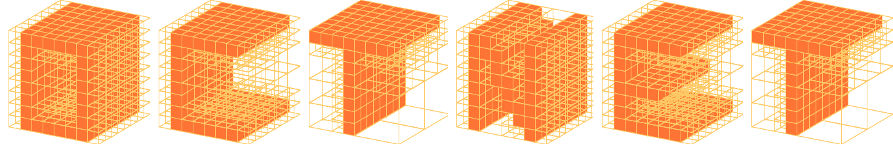

<p align="center"></p>

OctNet uses efficient space partitioning structures (i.e. octrees) to reduce memory and compute requirements of 3D convolutional neural networks, thereby enabling deep learning at high resolutions.

This is the code for the paper:

**[OctNet: Learning Deep 3D Representations at High Resolutions](https://arxiv.org/abs/1611.05009)**
<br>
[Gernot Riegler](https://griegler.github.io/), [Ali Osman Ulusoy](https://avg.is.tuebingen.mpg.de/person/oulusoy) and [Andreas Geiger](https://avg.is.tuebingen.mpg.de/person/ageiger)
<br>
[CVPR 2017](http://cvpr2017.thecvf.com/)

> We present OctNet, a representation for deep learning with sparse 3D data. In contrast to existing models, our representation enables 3D convolutional networks which are both deep and high resolution. Towards this goal, we exploit the sparsity in the input data to hierarchically partition the space using a set of unbalanced octrees where each leaf node stores a pooled feature representation. This allows to focus memory allocation and computation to the relevant dense regions and enables deeper networks without compromising resolution. We demonstrate the utility of our OctNet representation by analyzing the impact of resolution on several 3D tasks including 3D object classification, orientation estimation and point cloud labeling.

[](https://www.youtube.com/watch?v=qYyephF2BBw)

[GTC'17 Presentation](http://www.cvlibs.net/videos/gtc_17_talk.mp4)

If you find this code useful for your research, please cite

```
@inproceedings{Riegler2017OctNet,
  title={OctNet: Learning Deep 3D Representations at High Resolutions},
  author={Riegler, Gernot and Ulusoy, Ali Osman and Geiger, Andreas},
  booktitle={Proceedings of the IEEE Conference on Computer Vision and Pattern Recognition},
  year={2017}
}
```


## Code Overview
- `core` - This directory includes the core code for the hybrid grid-octree data structure (`include/octnet/core`), the CPU code for the network operations on this data structure (`include/octnet/cpu`), as well as some code to create test objects (`include/octnet/test`). 
- `core_gpu` - GPU (CUDA) code for the network operations.
- `create` - Code to pre-process 3D data (point clouds, meshes, dense volumes) and convert it to the grid-octree structure.
- `geometry` - Simple geometry routines mainly used in the `create` package.
- `py` - This directory a small python wrapper to the `create` package and some `core` functions. 
- `th` - A full featured torch wrapper for all network operations. 
- [`example`](example/01_classification_modelnet/) - Contains an example to create data and train a network on ModelNet10.


## Requirements
We tried to keep the requirements small.
To build the individual projects you will need:
- `cmake` to setup the projects
- `gcc`, or `clang` to build the core project
- `nvcc` (CUDA) to compile the GPU network operations
- `cython` to compile the Python wrapper
- `torch` to setup the torch wrapper

Optionally, you will need
- `OpenMP` for the parallelization of the CPU functions


## Build
The building process of the individual packages should be fairly easy. 
All packages, except the Python wrapper `py`, are cmake projects. 
Therefore, you can create a `build` directory in the individual package folder and call `cmake` and `make`.
For example, to build the `core` package:

    cd core
    mkdir build
    cd build
    cmake ..
    make -j

To build the Python wrapper just do

    cd py
    python setup.py build_ext --inplace

If you do not want to repeat this for all the packages, we provide two simple bash scripts that automate this process:
- `build_cpu.sh` - builds all the CPU code for OctNet
- `build_all.sh` - same as above, but also builds the GPU network functions and the GPU wrapper code for torch

